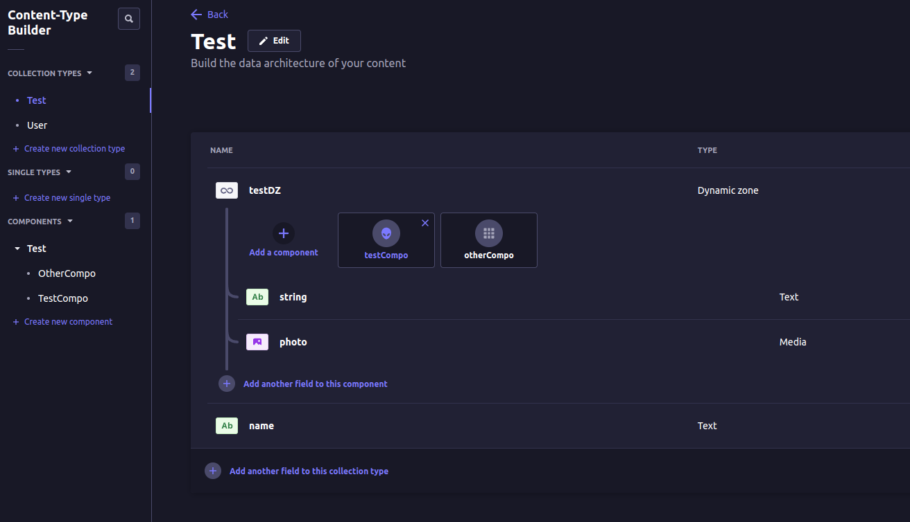

# Populating nested data inside of a Dynamic Zone/Component

When populating or constructing any of the Strapi operators we strong advise using the [qs](https://www.npmjs.com/package/qs) library.

Likewise you can find information on populating on the [Strapi Documentation](https://docs.strapi.io/dev-docs/api/rest/populate-select#components--dynamic-zones) including a [live QS editor](https://docs.strapi.io/dev-docs/api/rest/interactive-query-builder).

In the following examples you will see samples using the following content type from this repo:



You will always skip the "first" component in a dynamic zone since they are populated by default.

## Array Syntax with QS

The array syntax is useful if you just need basic population and don't plan to combine multiple nested operators.

QS Request:

```js
const qs = require('qs');

const query = qs.stringify({
  populate: ['testDZ.photo']
}, {
  encodeValuesOnly: true,
});

console.log('\n' + query)

```

QS Stringified LHS Bracket Syntax Output:

```js
populate[0]=testDZ.photo
```

API Response Output:

```json
{
  "data": [
    {
      "id": 1,
      "attributes": {
        "name": "test1",
        "createdAt": "2023-10-23T22:09:14.579Z",
        "updatedAt": "2023-10-23T22:09:15.346Z",
        "publishedAt": "2023-10-23T22:09:15.342Z",
        "testDZ": [
          {
            "id": 1,
            "__component": "test.test-compo",
            "string": "test1",
            "photo": {
              "data": [
                {
                  "id": 1,
                  "attributes": {
                    "name": "download.jpeg",
                    "alternativeText": null,
                    "caption": null,
                    "width": 1920,
                    "height": 1080,
                    "formats": {
                      "thumbnail": {
                        "name": "thumbnail_download.jpeg",
                        "hash": "thumbnail_download_f8a8da55b8",
                        "ext": ".jpeg",
                        "mime": "image/jpeg",
                        "path": null,
                        "width": 245,
                        "height": 138,
                        "size": 4.97,
                        "url": "/uploads/thumbnail_download_f8a8da55b8.jpeg"
                      },
                      "large": {
                        "name": "large_download.jpeg",
                        "hash": "large_download_f8a8da55b8",
                        "ext": ".jpeg",
                        "mime": "image/jpeg",
                        "path": null,
                        "width": 1000,
                        "height": 563,
                        "size": 58.11,
                        "url": "/uploads/large_download_f8a8da55b8.jpeg"
                      },
                      "medium": {
                        "name": "medium_download.jpeg",
                        "hash": "medium_download_f8a8da55b8",
                        "ext": ".jpeg",
                        "mime": "image/jpeg",
                        "path": null,
                        "width": 750,
                        "height": 422,
                        "size": 34.58,
                        "url": "/uploads/medium_download_f8a8da55b8.jpeg"
                      },
                      "small": {
                        "name": "small_download.jpeg",
                        "hash": "small_download_f8a8da55b8",
                        "ext": ".jpeg",
                        "mime": "image/jpeg",
                        "path": null,
                        "width": 500,
                        "height": 281,
                        "size": 16.4,
                        "url": "/uploads/small_download_f8a8da55b8.jpeg"
                      }
                    },
                    "hash": "download_f8a8da55b8",
                    "ext": ".jpeg",
                    "mime": "image/jpeg",
                    "size": 184.52,
                    "url": "/uploads/download_f8a8da55b8.jpeg",
                    "previewUrl": null,
                    "provider": "local",
                    "provider_metadata": null,
                    "createdAt": "2023-10-23T22:09:06.490Z",
                    "updatedAt": "2023-10-23T22:09:06.490Z"
                  }
                }
              ]
            }
          },
          {
            "id": 1,
            "__component": "test.other-compo",
            "string": "test2"
          }
        ]
      }
    }
  ],
  "meta": {
    "pagination": {
      "page": 1,
      "pageSize": 25,
      "pageCount": 1,
      "total": 1
    }
  }
}
```

## Object Syntax with QS

The object syntax is useful if you just advanced population combining multiple nested operators such as field selection, sorting, filtering, ect.

QS Request:

```js
const qs = require('qs');

const query = qs.stringify({
  populate: {
    testDZ: {
      populate: {
        photo: {
          fields: ['id', 'url']
        }
      }
    }
  }
}, {
  encodeValuesOnly: true,
});

console.log('\n' + query)
```

QS Stringified LHS Bracket Syntax Output:

```js
populate[testDZ][populate][photo][fields][0]=id&populate[testDZ][populate][photo][fields][1]=url
```

API Response Output:

```json
{
  "data": [
    {
      "id": 1,
      "attributes": {
        "name": "test1",
        "createdAt": "2023-10-23T22:09:14.579Z",
        "updatedAt": "2023-10-23T22:09:15.346Z",
        "publishedAt": "2023-10-23T22:09:15.342Z",
        "testDZ": [
          {
            "id": 1,
            "__component": "test.test-compo",
            "string": "test1",
            "photo": {
              "data": [
                {
                  "id": 1,
                  "attributes": {
                    "url": "/uploads/download_f8a8da55b8.jpeg"
                  }
                }
              ]
            }
          },
          {
            "id": 1,
            "__component": "test.other-compo",
            "string": "test2"
          }
        ]
      }
    }
  ],
  "meta": {
    "pagination": {
      "page": 1,
      "pageSize": 25,
      "pageCount": 1,
      "total": 1
    }
  }
}
```
